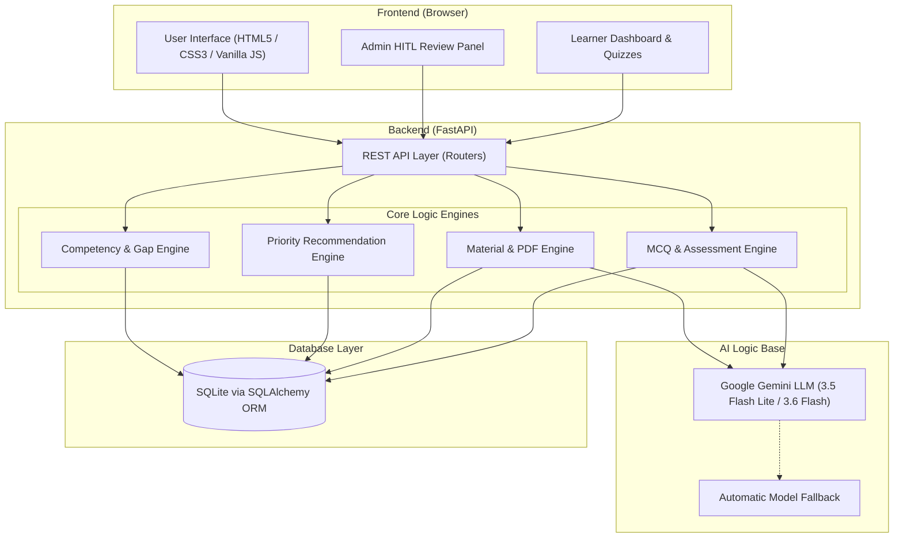
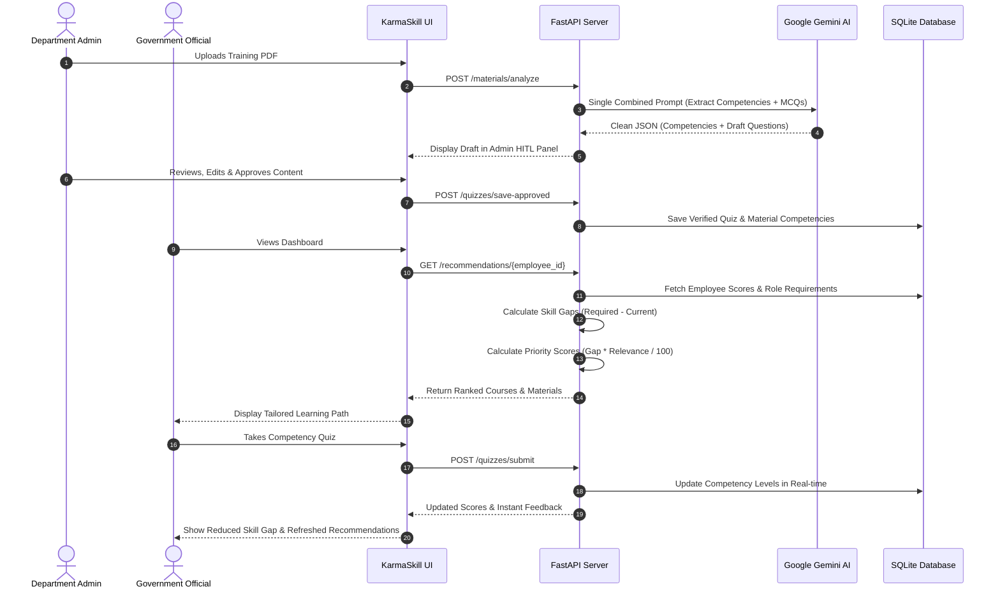

# KarmaSkill AI

> **AI-Powered Competency Assessment & Adaptive Learning Recommendation Engine**  
> Empowering India's statistical and administrative workforce for a future-ready governance ecosystem.

---

## 🔗 Quick Links & Demos

| Resource | Link |
| :--- | :--- |
| 🌐 **Live Website Demo** | [Click Here!](https://kamaskill-ai.vercel.app/) |
| 🎥 **YouTube Video Demo** | [Click Here!](https://www.youtube.com/watch?v=ZzVei-CBUWE) |
| 📑 **Project Documentation** | [Click Here!](https://docs.google.com/document/d/1lu3H1aefZ-orm2mEYBWPHPCbjbTdXB5q8-lvbqir-rw/edit?usp=sharing) |

---

## 👥 Team & Problem Details

- **Team Name:** NEXUS 06
- **Problem Statement ID:** 26101

### Problem Statement Description
> India’s Official Statistical System is rapidly adopting AI, ML, Big Data, GIS, cloud computing, and modern statistical technologies. Officials therefore need continuous upskilling. Although the iGOT Karmayogi platform provides extensive learning resources, officials may find it difficult to identify courses relevant to their roles, existing skills, and future requirements.
>
> The proposed AI-enabled Learning Management System (LMS) will assess an official’s competencies, identify skill gaps, and recommend personalized learning pathways through integration with iGOT Karmayogi. It will use AI-powered assessments, virtual assistants, adaptive learning, real-time feedback, and analytics to support continuous capacity building and create a future-ready workforce.

---

## 💡 What is Our Solution?

**KarmaSkill AI** is an intelligent learning and competency platform designed for government officials. Instead of searching through hundreds of uncategorized courses, officials get a clear, guided path to upskill.

Here is what the platform does:
1. **Maps Roles to Core Competencies:** Each job role (e.g., Statistical Officer, Data Analyst) has benchmarked competency requirements.
2. **Finds Real Skill Gaps:** Compares an official's current verified proficiency with their target role benchmark to calculate precise skill gaps.
3. **Recommends Personalized Courses & Documents:** Automatically prioritizes courses and internal department reading materials using a mathematical gap-coverage formula.
4. **Turns Training PDFs into Quizzes:** Officials and trainers can upload training PDFs, and our AI instantly extracts key competencies and generates practice assessments.
5. **Tracks Growth in Real-Time:** As officials complete quizzes, their competency scores update immediately, dynamically refreshing their learning recommendations.

---

## ⭐ Unique Selling Propositions (USP)

- **🔄 Human-in-the-Loop (HITL) AI Pipeline:**  
  AI creates draft quizzes and extracts competencies from uploaded documents, but does not publish them blindly. Subject matter experts and administrators review, edit, approve, or reject AI outputs through an interactive admin panel before anything reaches learners. This ensures zero hallucinations and complete pedagogical accuracy.
- **🎯 Dual-Source Recommendation Engine:**  
  Seamlessly connects standard catalog courses (iGOT Karmayogi style) with internal departmental training PDFs and whitepapers in a unified, prioritized learning feed.
- **📊 Mathematical Priority Ranking:**  
  Recommendations are ranked using an objective priority score formula:  
  $$\text{Priority Score} = \frac{\text{Skill Gap} \times \text{Material Relevance}}{100}$$  
  High-priority needs stand out immediately, saving learners valuable time.
- **⚡ Dynamic Competency Recalculation:**  
  Scores are not static. Every quiz attempt updates the user's competency profile in real time, closing skill gaps dynamically.
- **🪶 Lightweight & Blazing Fast:**  
  Runs on a modular, lightweight stack with fast page loads, zero heavy frontend framework overhead, and automated database setup.

---

## 🛠️ Tech Stack Used

### 🖥️ Frontend
- **HTML5 & CSS3:** Semantic markup, responsive design, custom CSS components, and glassmorphic dashboard styling.
- **Vanilla JavaScript (ES6+):** Fast, dependency-free client-side logic, real-time DOM updates, and modular state management.
- **Font Awesome Icons:** Visual UI cues and clean iconography.

### ⚙️ Backend
- **Python 3.10+:** Core programming language.
- **FastAPI:** High-performance, asynchronous REST API framework with automatic OpenAPI/Swagger documentation.
- **Uvicorn:** Lightning-fast ASGI production web server.
- **Pydantic:** Strict data validation and settings management.

### 🧠 AI Logic Base
- **Google Gemini Models (`gemini-3.5-flash-lite`, `gemini-3.6-flash`):** High-speed LLM inference for competency mapping, syllabus analysis, and MCQ generation.
- **PyPDF (`pypdf`):** Text and metadata extraction from departmental PDF guidelines and training decks.
- **Combined Single-Prompt Pipeline:** Merges competency analysis and question generation into one unified call to minimize token usage and latency.
- **Dual-Model Fallback Engine:** Automatically switches to fallback models to ensure high availability and prevent rate limits.

### 🗄️ Database
- **SQLite3:** Embedded relational database for zero-config local setup.
- **SQLAlchemy ORM:** Declarative data modeling, relationship cascading, and structured SQL querying.
- **Auto-Migration Layer:** Built-in schema upgrade scripts for non-breaking database evolution.

---

## 🚀 How We Made the Website

### Initial Idea
Government officials in the statistical department need quick, targeted upskilling in AI, GIS, and modern statistics. Today's portals have plenty of materials, but finding the exact right course for a specific job role is overwhelming.  
Our idea was simple: build a smart system that benchmarks what an official knows today, compares it with what their role requires tomorrow, and delivers an exact, prioritized roadmap with self-assessments to bridge that gap.

### Project Directory Structure
```text
KarmaSkillAI/
├── frontend/                     # Client application
│   ├── index.html                # Main application interface
│   ├── css/                      # Custom stylesheets
│   ├── js/                       # Modular JavaScript files
│   │   ├── app.js                # Core app initialization & routing
│   │   ├── api.js                # Backend API client
│   │   ├── state.js              # Shared client-side state
│   │   ├── dashboard.js          # Dashboard views & analytics
│   │   ├── admin.js              # Admin review & HITL pipeline
│   │   ├── assessments.js        # Quiz taking & grading interface
│   │   ├── learning.js           # Learning materials viewer
│   │   ├── recommendations.js    # Personalized recommendation feeds
│   │   └── profile.js            # User role & skill gap viewer
│   └── assets/                   # Images, badges, and icons
├── backend/                      # FastAPI application
│   ├── main.py                   # Application entry point & CORS
│   ├── database.py               # Database engine & session setup
│   ├── models.py                 # SQLAlchemy relational schema
│   ├── schemas.py                # Pydantic request/response schemas
│   ├── seed.py                   # Initial mock data for roles & courses
│   ├── migrate_db.py             # Schema migration utilities
│   ├── routers/                  # API endpoints
│   │   ├── employees.py          # Employee profile & competency APIs
│   │   ├── competencies.py       # Competency list & details
│   │   ├── roles.py              # Role definitions & target thresholds
│   │   ├── recommendations.py    # Recommendation logic endpoints
│   │   ├── materials.py          # PDF upload & HITL endpoints
│   │   ├── quizzes.py            # Quiz generation & attempt tracking
│   │   └── courses.py            # Course catalog endpoints
│   └── services/                 # Business & AI logic
│       ├── gemini_service.py     # Gemini client with fallback handling
│       ├── material_engine.py    # PDF text processing & combined AI calls
│       ├── mcq_engine.py         # Assessment generation algorithms
│       └── recommendation_engine.py # Priority ranking & gap calculations
├── data/                         # Sample datasets & documents
├── requirements.txt              # Python project dependencies
└── README.md                     # Documentation
```

### Challenges We Ran Into & How We Fixed Them

1. **LLM Output Formatting Issues:**
   - *Problem:* LLM responses occasionally contained Markdown backticks (`` ```json ... ``` ``) or conversational text, which crashed JSON parsers.
   - *Fix:* Created a robust regex sanitization helper (`clean_json_response`) that strips away any markdown formatting before parsing.

2. **API Latency and Rate Limit Overheads:**
   - *Problem:* Running separate AI calls for competency extraction and quiz creation doubled the wait time and hit API quotas.
   - *Fix:* Engineered a unified prompt (`analyze_material_and_generate_quiz`) that extracts competencies and creates MCQs in a single request, cutting latency and token consumption by 50%.

3. **Preventing AI Hallucinations in Official Tests:**
   - *Problem:* Direct AI generation could produce faulty questions or wrong answer keys.
   - *Fix:* Introduced our **Human-in-the-Loop (HITL)** staging pipeline. Generated quizzes are held in a pending state until an admin verifies and approves them.

4. **Database Schema Evolution:**
   - *Problem:* Adding support for custom materials to quizzes created foreign key constraint mismatches in existing SQLite tables.
   - *Fix:* Wrote an automatic migration script (`migrate_db.py`) that checks and patches table schemas automatically on startup without data loss.

---

## 🏛️ Project Architecture



---

## 🔄 Project Working Pipeline



### Step-by-Step Breakdown:
1. **Profiling & Benchmarking:** The official's current competencies are mapped against the required levels of their specific role.
2. **Gap Analysis:** The system identifies competencies where `Current Level < Required Level`.
3. **AI Content Processing:** Departmental training PDFs are uploaded, parsed, and converted into structured competencies and quizzes by Gemini.
4. **Human-in-the-Loop Verification:** Subject matter experts review and approve questions to guarantee quality.
5. **Smart Recommendation:** Officials receive a prioritized list of courses and materials tailored to their biggest skill gaps.
6. **Assessment & Dynamic Update:** Officials complete interactive quizzes, scores are recorded, and their competency gaps close in real time.

---

## 📄 License

This project is developed for educational and hackathon demonstration purposes under the Smart India Hackathon (SIH) initiative.
